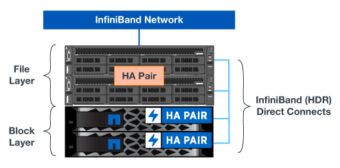

= Présentation de l'architecture
:hardbreaks:
:allow-uri-read: 
:nofooter: 
:icons: font
:linkattrs: 
:imagesdir: ./media/

[role="lead"]
La solution BeeGFS sur NetApp inclut des critères de conception architecturale qui permettent de déterminer l'équipement, le câblage et les configurations qui sont requis pour prendre en charge les workloads validés.

== Architecture modulaire

Le système de fichiers BeeGFS peut être déployé et adapté de différentes manières, en fonction des besoins en stockage. Par exemple, certains cas d'utilisation mettant en avant de nombreux fichiers de petite taille bénéficieront d'une performance et d'une capacité supplémentaires de métadonnées, tandis que les cas d'utilisation comportant moins de fichiers volumineux peuvent favoriser une capacité de stockage et des performances supérieures pour le contenu réel des fichiers. Ces considérations ont un impact sur les différentes dimensions du déploiement d'un système de fichiers parallèle, ce qui ajoute de la complexité à la conception et au déploiement d'un système de fichiers.

En réponse à ces défis, NetApp a conçu une architecture d'éléments de base standard qui permet une évolutivité horizontale de chaque catégorie. De façon générale, les éléments de base BeeGFS sont déployés dans l'un des trois profils de configuration suivants :

* Un élément de base unique, incluant la gestion BeeGFS, les métadonnées et les services de stockage
* Des métadonnées BeeGFS plus un élément de base du stockage
* Un élément de base de stockage BeeGFS uniquement

Le seul changement matériel entre ces trois options est l'utilisation de lecteurs plus petits pour les métadonnées BeeGFS. Dans le cas contraire, toutes les modifications de configuration sont appliquées via le logiciel. En outre, avec Ansible comme moteur de déploiement, la configuration du profil souhaité pour un élément de base particulier simplifie les tâches de configuration.

Pour plus de détails, voir <<Conception matérielle vérifiée>>.

== Services de système de fichiers

Le système de fichiers BeeGFS inclut les principaux services suivants :

* *Service de gestion.* registres et contrôle tous les autres services.
* *Service de stockage.* stocke le contenu des fichiers d'utilisateur distribués appelé fichiers de bloc de données.
* *Service de métadonnées.* assure le suivi de la disposition du système de fichiers, du répertoire, des attributs de fichier, etc.
* *Service client.* monte le système de fichiers pour accéder aux données stockées.

La figure suivante présente les composants et les relations de la solution BeeGFS utilisés avec les systèmes NetApp E-Series.

image:../media/beegfs-components.png[""]

En tant que système de fichiers parallèle, BeeGFS répartit ses fichiers sur plusieurs nœuds de serveur afin de maximiser les performances en lecture/écriture et l'évolutivité. Les nœuds de serveur fonctionnent ensemble pour fournir un système de fichiers unique pouvant être monté et accessible simultanément par d'autres nœuds de serveur, communément appelés _clients_. Ces clients peuvent voir et consommer le système de fichiers distribué de la même manière qu'un système de fichiers local tel que NTFS, XFS ou ext4.

Les quatre services principaux fonctionnent sur un large éventail de distributions Linux prises en charge et communiquent via n'importe quel réseau compatible TCP/IP ou RDMA, y compris InfiniBand (IB), Omni-Path (OPA) et RDMA over Converged Ethernet (RoCE). Les services de serveur BeeGFS (gestion, stockage et métadonnées) sont des démons d'espace utilisateur, alors que le client est un module de noyau natif (sans patchless). Tous les composants peuvent être installés ou mis à jour sans redémarrage. Vous pouvez en outre exécuter n'importe quelle combinaison de services sur le même nœud.

== Nœuds vérifiés

La solution BeeGFS sur NetApp inclut les nœuds vérifiés suivants : le système de stockage NetApp EF600 (nœud bloc) et le serveur Lenovo ThinkSystem SR665 (nœud de fichier).

=== Nœud bloc : système de stockage EF600

La baie 100 % Flash NetApp EF600 assure un accès aux données cohérent en temps quasi réel avec un nombre illimité de workloads. Pour alimenter rapidement et en continu les données des applications d'IA et HPC, les systèmes de stockage EF600 fournissent jusqu'à 2 millions d'IOPS en lecture cache, des temps de réponse inférieurs à 100 microsecondes et un débit de lecture séquentielle de 42 Gbit/s dans un seul boîtier.

=== Nœud de fichier : serveur Lenovo ThinkSystem SR665

Le SR665 est un serveur 2U à deux sockets doté de la technologie PCIe 4.0. Lorsqu'elle est configurée pour répondre aux besoins de cette solution, elle permet d'exécuter des services de fichiers BeeGFS dans une configuration bien équilibrée avec la disponibilité du débit et des IOPS fournie par les nœuds E-Series à connexion directe.

Pour plus d'informations sur le Lenovo SR665, reportez-vous à la section https://lenovopress.com/lp1269-thinksystem-sr665-server["Site Web de Lenovo"^].

== Conception matérielle vérifiée

Les éléments de base de la solution (illustrée dans la figure ci-dessous) utilisent deux serveurs PCIe 4.0 à double socket pour la couche de fichiers BeeGFS et deux systèmes de stockage EF600 comme la couche bloc.

NOTE: Chaque élément de base inclut deux nœuds de fichiers BeeGFS, un minimum de deux éléments de base est requis pour établir le quorum dans le cluster de basculement. Vous pouvez configurer un cluster à deux nœuds, mais cette configuration présente des limites susceptibles d'empêcher un basculement réussi. Si vous avez besoin d'un cluster à deux nœuds, vous pouvez incorporer un troisième périphérique en tant qu'Tiebreaker (mais cette conception n'est pas couverte par ce site).

Chaque élément de base offre une haute disponibilité via une conception matérielle à deux niveaux qui sépare les domaines de défaillance des couches de fichiers et de blocs. Chaque Tier peut basculer indépendamment, ce qui améliore la résilience et réduit le risque de pannes en cascade. L'utilisation de la technologie HDR InfiniBand associée à NVMeOF offre un débit élevé et une latence minimale entre les nœuds de fichiers et de blocs, avec une redondance complète et une sursouscription suffisante des liaisons pour éviter que la conception désagrégée ne devienne un goulot d'étranglement, même si le système est partiellement dégradé.

La solution BeeGFS sur NetApp s'exécute sur tous les éléments de base du déploiement. Le premier élément de base déployé doit exécuter des services de gestion BeeGFS, de métadonnées et de stockage (appelé élément de base). Tous les éléments de base ultérieurs sont configurés via le logiciel pour exécuter des services de métadonnées et de stockage BeeGFS ou uniquement des services de stockage. La disponibilité de différents profils de configuration pour chaque élément de base permet de faire évoluer les métadonnées du système de fichiers ou la capacité et les performances du stockage en utilisant les mêmes plateformes matérielles sous-jacentes et la même conception d'éléments de base.

Jusqu'à cinq éléments de base sont combinés dans un cluster Linux HA autonome, garantissant un nombre raisonnable de ressources par gestionnaire de ressources de cluster (Pacemaker) et réduisant la surcharge de messagerie requise pour maintenir la synchronisation des membres du cluster (Corosync). Un minimum de deux blocs de construction par grappe est recommandé pour permettre à un nombre suffisant de membres d'établir le quorum. Un ou plusieurs de ces clusters autonomes BeeGFS HA sont combinés pour créer un système de fichiers BeeGFS (illustré dans la figure suivante) qui est accessible aux clients comme un seul espace de noms de stockage.

image:../media/beegfs-design-image3.png[""]

Bien qu'au final, le nombre d'éléments de base par rack dépend des besoins en alimentation et en climatisation d'un site donné, La solution a été conçue de sorte à déployer jusqu'à cinq éléments de base dans un seul rack 42U tout en laissant de l'espace à deux commutateurs InfiniBand 1U utilisés pour le réseau de stockage/données. Chaque module nécessite huit ports IB (quatre par commutateur pour la redondance). Ainsi, cinq blocs de construction laissent la moitié des ports sur un commutateur InfiniBand HDR à 40 ports (comme le NVIDIA QM8700) disponible pour implémenter une topologie FAT-Tree ou non bloquante similaire. Cette configuration garantit une évolutivité verticale du nombre de racks de stockage ou de calcul/GPU sans goulets d'étranglement du réseau. Il est également possible d'utiliser une structure de stockage sursouscrite à l'aide des recommandations du fournisseur de la structure de stockage.

L'image suivante montre une topologie arborescence FAT à 80 nœuds.

image:../media/beegfs-design-image4.png[""]

En utilisant Ansible comme moteur de déploiement pour déployer BeeGFS sur NetApp, les administrateurs peuvent gérer tout l'environnement en utilisant une infrastructure moderne comme du code. Cela simplifie considérablement le fonctionnement d'un système complexe, permettant aux administrateurs de définir et d'ajuster la configuration en un seul emplacement, puis de s'assurer de son application cohérente quelle que soit la taille de l'environnement. La collection BeeGFS est disponible à partir de https://galaxy.ansible.com/netapp_eseries/beegfs["Galaxy Ansible"^] et https://github.com/netappeseries/beegfs/["NetApp E-Series GitHub"^].
