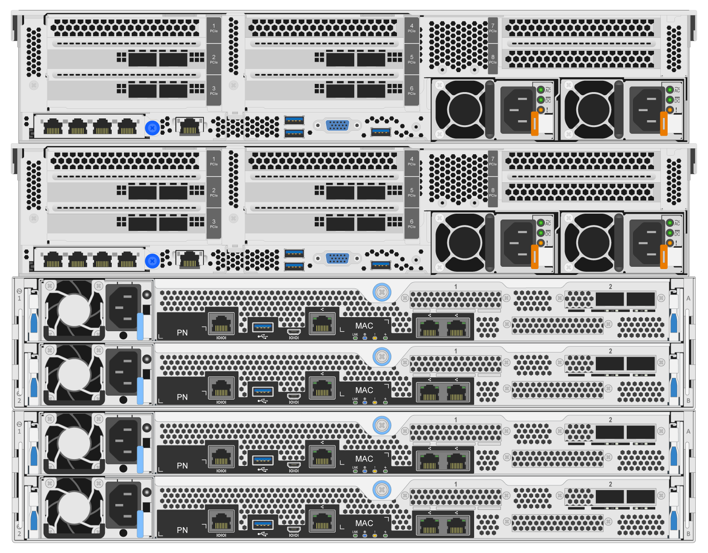

= Déployez le matériel
:hardbreaks:
:allow-uri-read: 
:nofooter: 
:icons: font
:linkattrs: 
:imagesdir: ./media/

[role="lead"]
Chaque module comprend deux nœuds de fichiers x86 validés directement connectés à deux nœuds de bloc à l'aide de câbles InfiniBand HDR (200 Go).

NOTE: Chaque élément de base inclut deux nœuds de fichiers BeeGFS, un minimum de deux éléments de base est requis pour établir le quorum dans le cluster de basculement. Bien qu'il soit possible de configurer un cluster à deux nœuds, certaines limites à cette configuration permettent d'empêcher le basculement de se produire dans certains scénarios. Si un cluster à deux nœuds est nécessaire, il est également possible d'intégrer un troisième périphérique comme Tiebreaker, bien qu'il ne soit pas couvert dans cette procédure de déploiement.

Sauf mention contraire, les étapes suivantes sont identiques pour chaque élément de base du cluster, que ce soit pour exécuter des métadonnées et des services de stockage BeeGFS ou des services de stockage uniquement.

.Étapes
. Configurez chaque nœud de fichier BeeGFS avec quatre adaptateurs de canal hôte (HCA) à double port PCIe 4.0 ConnectX-6 en mode InfiniBand et installez-les dans les emplacements PCIe 2, 3, 5 et 6.
. Configurez chaque nœud de bloc BeeGFS avec une carte d'interface hôte (HIC) à deux ports 200 Go et installez la HIC dans chacun de ses deux contrôleurs de stockage.
+
Placez les éléments de base de façon à ce que les deux nœuds de fichier BeeGFS se trouvent au-dessus des nœuds de bloc BeeGFS. La figure suivante montre la configuration matérielle correcte pour le bloc de construction BeeGFS (vue arrière).

+

+

NOTE: La configuration de l'alimentation électrique pour les cas d'utilisation en production doit généralement utiliser des blocs d'alimentation redondants.

. Si nécessaire, installez les lecteurs dans chacun des nœuds de bloc BeeGFS.
+
.. Si le module sera utilisé pour exécuter des métadonnées et des services de stockage BeeGFS et des disques plus petits sont utilisés pour les volumes de métadonnées, vérifiez qu'ils sont renseignés dans les emplacements de disque les plus à l'extérieur, comme indiqué dans la figure ci-dessous.
.. Pour toutes les configurations d'éléments de base, si un boîtier de disque n'est pas plein, assurez-vous qu'un nombre égal de disques est utilisé dans les emplacements 0–11 et 12–23 pour des performances optimales.
+
image:../media/driveslots.png[""]

. Pour câbler les nœuds de fichier et de bloc, utilisez des câbles en cuivre à connexion directe 1 m InfiniBand HDR de 200 Go, de sorte qu'ils correspondent à la topologie illustrée dans la figure ci-dessous.
+
image:../media/directattachcable.png[""]

+

NOTE: Les nœuds répartis entre plusieurs éléments de base ne sont jamais directement connectés. Chaque élément de base doit être considéré comme une unité autonome et toute communication entre les éléments de base se fait par le biais de commutateurs réseau.

. Utilisez des câbles en cuivre à connexion directe 2 m (ou la longueur appropriée) InfiniBand HDR de 200 Go pour raccorder les ports InfiniBand restants de chaque nœud de fichiers aux commutateurs InfiniBand qui seront utilisés pour le réseau de stockage.
+
Si des commutateurs InfiniBand redondants sont utilisés, reliez les ports surlignés en vert clair dans la figure suivante aux différents commutateurs.

+
image:../media/networkcable.png[""]

. Au besoin, assembler des éléments de construction supplémentaires en suivant les mêmes directives de câblage.
+

NOTE: Le nombre total d'éléments de base pouvant être déployés dans un rack unique dépend de l'alimentation et du refroidissement disponibles sur chaque site.

