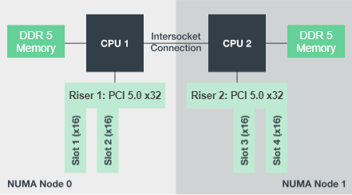

= Configuration matérielle
:hardbreaks:
:allow-uri-read: 
:nofooter: 
:icons: font
:linkattrs: 
:imagesdir: ./media/

[role="lead"]
La configuration matérielle de BeeGFS sur NetApp inclut des nœuds de fichiers et le câblage réseau.

== Configuration de nœud de fichiers

Les nœuds de fichiers ont deux sockets de CPU configurés en zones NUMA distinctes, qui incluent un accès local à un nombre égal de slots PCIe et de mémoire.

Les adaptateurs InfiniBand doivent être placés dans les connecteurs ou les cartes de montage PCI appropriés, de sorte que la charge de travail soit équilibrée sur les voies PCIe et les canaux de mémoire disponibles. Pour équilibrer la charge de travail, vous pouvez isoler intégralement le travail des services BeeGFS vers un nœud NUMA particulier. L'objectif est d'atteindre les mêmes performances pour chaque nœud de fichiers que s'il s'agissait de deux serveurs à socket unique indépendants.

La figure suivante montre la configuration NUMA du nœud de fichiers.

Les processus BeeGFS sont épinglés à une zone NUMA particulière pour s'assurer que les interfaces utilisées se trouvent dans la même zone. Cette configuration évite d'avoir besoin d'un accès à distance via la connexion inter-socket. La connexion inter-sockets est parfois appelée liaison QPI ou GMI2 ; même dans les architectures de processeurs modernes, ils peuvent être un goulot d'étranglement lors de l'utilisation de réseaux haut débit comme HDR InfiniBand.

== Configuration des câbles réseau

Dans un élément de base, chaque nœud de fichier est connecté à deux nœuds de bloc grâce à quatre connexions InfiniBand redondantes. En outre, chaque nœud de fichiers dispose de quatre connexions redondantes au réseau de stockage InfiniBand.

Dans la figure suivante, notez que :

* Tous les ports de nœuds de fichiers indiqués en vert sont utilisés pour la connexion au maillage Storage Fabric ; tous les autres ports de nœuds de fichiers sont les connexions directes aux nœuds de blocs.
* Deux ports InfiniBand d'une zone NUMA spécifique se connectent aux contrôleurs A et B du même nœud de bloc.
* Les ports du nœud NUMA 0 se connectent toujours au premier nœud de bloc.
* Les ports du nœud NUMA 1 se connectent au second nœud de bloc.

image:../media/beegfs-design-image6.png[""]

NOTE: Lors de l'utilisation de câbles de séparation pour connecter le commutateur de stockage aux nœuds de fichiers, un câble doit se brancher et se connecter aux ports indiqués en vert clair. Un autre câble doit se brancher et se connecter aux ports indiqués en vert foncé. En outre, pour les réseaux de stockage avec commutateurs redondants, les ports indiqués en vert clair doivent se connecter à un commutateur, tandis que les ports en vert foncé doivent se connecter à un autre commutateur.

La configuration de câblage illustrée dans la figure permet à chaque service BeeGFS de :

* Exécuter dans la même zone NUMA, quel que soit le nœud de fichier qui exécute le service BeeGFS.
* Disposer de chemins optimaux secondaires au réseau de stockage frontal et aux nœuds de blocs internes, quel que soit l'endroit où une défaillance se produit
* Réduisez l'impact sur la performance si un nœud de fichiers ou un contrôleur d'un nœud de blocs nécessite une maintenance.

.Câblage pour exploiter la bande passante
Pour exploiter la bande passante bidirectionnelle PCIe complète, vérifiez que un port de chaque adaptateur InfiniBand se connecte à la structure de stockage, et que l'autre port est connecté à un nœud de bloc.

La figure suivante montre la conception de câblage utilisée pour exploiter la bande passante bidirectionnelle PCIe complète.

image:../media/beegfs-design-image7.png[""]

Pour chaque service BeeGFS, utilisez la même carte pour connecter le port préféré utilisé pour le trafic client avec le chemin vers le contrôleur de nœuds de bloc qui est le principal propriétaire de ces volumes de services. Pour plus d'informations, voir link:beegfs-design-software-architecture.html["Configuration logicielle"].
