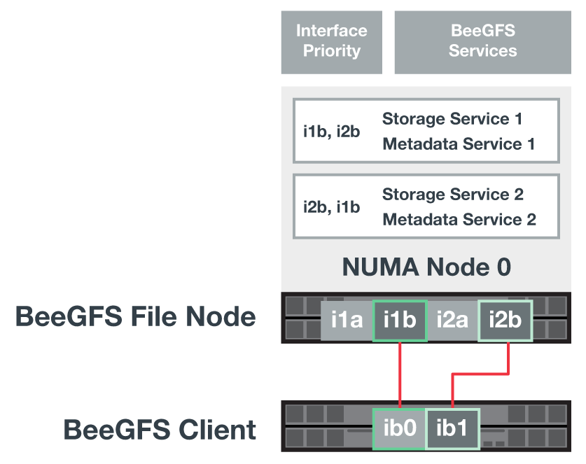
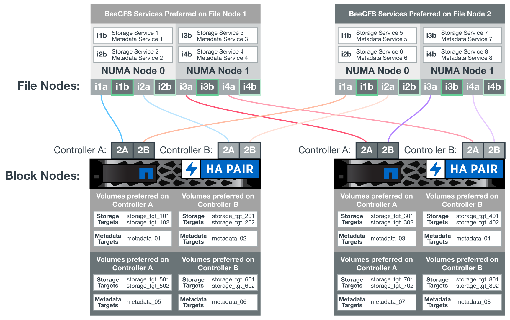
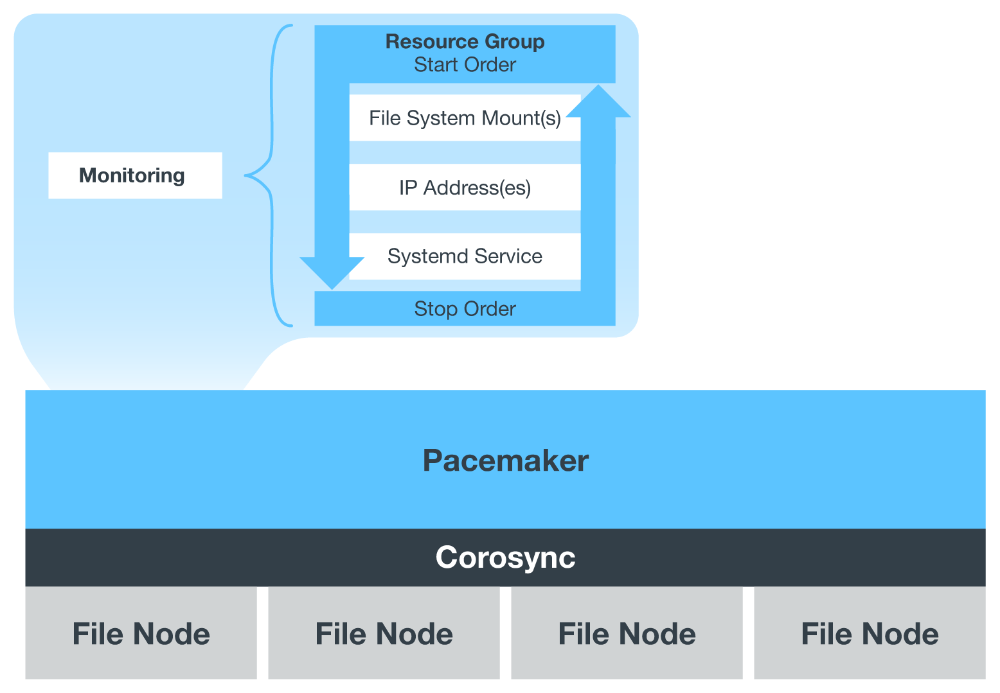

= Configuration logicielle
:hardbreaks:
:allow-uri-read: 
:nofooter: 
:icons: font
:linkattrs: 
:imagesdir: ./media/

[role="lead"]
La configuration logicielle de BeeGFS sur NetApp inclut des composants réseau BeeGFS, des nœuds de bloc EF600, des nœuds de fichiers BeeGFS, des groupes de ressources et des services BeeGFS.

== Configuration réseau BeeGFS

La configuration du réseau BeeGFS comprend les composants suivants.

* *IP flottantes* les adresses IP flottantes sont un type d'adresse IP virtuelle qui peut être routée dynamiquement vers n'importe quel serveur du même réseau. Plusieurs serveurs peuvent posséder la même adresse IP flottante, mais elle ne peut être active que sur un seul serveur à la fois.
+
Chaque service de serveur BeeGFS possède sa propre adresse IP qui peut se déplacer entre les nœuds de fichiers en fonction de l'emplacement d'exécution du service de serveur BeeGFS. Cette configuration IP flottante permet à chaque service de basculer indépendamment vers l'autre nœud de fichiers. Le client a simplement besoin de connaître l'adresse IP d'un service BeeGFS particulier; il n'est pas nécessaire de savoir quel nœud de fichier exécute actuellement ce service.

* *Configuration multi-homing du serveur BeeGFS* pour augmenter la densité de la solution, chaque nœud de fichiers a plusieurs interfaces de stockage avec des adresses IP configurées dans le même sous-réseau IP.
+
Des configurations supplémentaires sont nécessaires pour s'assurer que cette configuration fonctionne comme prévu avec la pile réseau Linux, car par défaut, les requêtes à une interface peuvent être traitées sur une autre interface si leurs adresses IP se trouvent dans le même sous-réseau. Outre d'autres inconvénients, ce comportement par défaut rend impossible l'établissement ou la maintenance des connexions RDMA.

+
Le déploiement Ansible gère le serrage du comportement de la RP (reverse path) et du protocole ARP (Address Resolution Protocol), ainsi que la vérification du démarrage et de l'arrêt d'adresses IP flottantes ; les routes et règles IP correspondantes sont créées dynamiquement pour permettre à la configuration réseau multihomée de fonctionner correctement.

* *Configuration multi-rail client BeeGFS* _Multi-rail_ désigne la capacité d'une application d'utiliser des « rails » de réseau indépendants multiples pour augmenter les performances.
+
Bien que BeeGFS peut utiliser RDMA pour la connectivité, BeeGFS utilise IPoIB pour simplifier la recherche et la création de connexions RDMA. Pour permettre aux clients BeeGFS d'utiliser plusieurs interfaces InfiniBand, vous pouvez configurer chaque client avec une adresse IP située dans un sous-réseau différent, puis configurer les interfaces préférées pour la moitié des services serveur BeeGFS dans chaque sous-réseau.

+
Dans le schéma suivant, les interfaces surlignées en vert clair se trouvent dans un sous-réseau IP (par exemple, `100.127.0.0/16`) et les interfaces vert foncé sont situées dans un autre sous-réseau (par exemple, `100.128.0.0/16`).

+
La figure suivante montre l'équilibrage du trafic sur plusieurs interfaces client BeeGFS.

+

+
Comme chaque fichier de BeeGFS est généralement réparti sur plusieurs services de stockage, la configuration multi-rail permet au client d'atteindre un débit supérieur à celui d'un seul port InfiniBand. Par exemple, l'exemple de code suivant montre une configuration commune de répartition des fichiers qui permet au client d'équilibrer le trafic entre les deux interfaces :

+
....
root@ictad21h01:/mnt/beegfs# beegfs-ctl --getentryinfo myfile
Entry type: file
EntryID: 11D-624759A9-65
Metadata node: meta_01_tgt_0101 [ID: 101]
Stripe pattern details:
+ Type: RAID0
+ Chunksize: 1M
+ Number of storage targets: desired: 4; actual: 4
+ Storage targets:
  + 101 @ stor_01_tgt_0101 [ID: 101]
  + 102 @ stor_01_tgt_0101 [ID: 101]
  + 201 @ stor_02_tgt_0201 [ID: 201]
  + 202 @ stor_02_tgt_0201 [ID: 201]
....
+
L'utilisation de deux sous-réseaux IPoIB est une distinction logique. Si vous le souhaitez, vous pouvez utiliser un seul sous-réseau InfiniBand physique (réseau de stockage).

+

NOTE: Le support multi-rail a été ajouté dans BeeGFS 7.3.0 pour permettre l'utilisation de plusieurs interfaces IB dans un seul sous-réseau IPoIB. Le design de la solution BeeGFS sur NetApp a été développé avant la disponibilité générale de BeeGFS 7.3.0, et démontre ainsi l'utilisation de deux sous-réseaux IP pour utiliser deux interfaces IB sur les clients BeeGFS. L'un des avantages de l'approche de sous-réseau IP multiple est d'éliminer la nécessité de configurer plusieurs systèmes d'accueil sur les nœuds clients BeeGFS (pour plus d'informations, voir https://doc.beegfs.io/7.3.0/advanced_topics/rdma_support.html["Prise en charge de RDMA BeeGFS"^]).

== Configuration de nœud en mode bloc EF600

Les nœuds de blocs comprennent deux contrôleurs RAID actifs/actifs avec accès partagé au même ensemble de lecteurs. En général, chaque contrôleur possède la moitié des volumes configurés sur le système, mais il peut reprendre l'autre contrôleur si nécessaire.

Le logiciel de chemins d'accès multiples des nœuds de fichiers détermine le chemin actif et optimisé vers chaque volume et le déplace automatiquement vers l'autre chemin d'accès en cas de défaillance du câble, de l'adaptateur ou du contrôleur.

Le schéma suivant illustre la disposition du contrôleur dans les nœuds de bloc EF600.

image:../media/beegfs-design-image9.png[""]

Pour faciliter la solution haute disponibilité du disque partagé, les volumes sont mappés sur les deux nœuds de fichiers de manière à ce qu'ils puissent prendre en charge les uns les autres selon les besoins. Le diagramme suivant montre un exemple de configuration du service BeeGFS et de la propriété du volume préféré pour des performances maximales. L'interface à gauche de chaque service BeeGFS indique l'interface préférée que les clients et les autres services utilisent pour le contacter.

Dans l'exemple précédent, les clients et les services serveur préfèrent communiquer avec le service de stockage 1 via l'interface i1b. Le service de stockage 1 utilise l'interface i1a comme chemin préféré pour communiquer avec ses volumes (Storage_tgt_101, 102) sur le contrôleur A du premier nœud de bloc. Cette configuration utilise la bande passante PCIe bidirectionnelle complète disponible pour l'adaptateur InfiniBand et offre de meilleures performances avec un adaptateur HDR InfiniBand à deux ports que le tout avec PCIe 4.0.

== Configuration de nœud de fichier BeeGFS

Les nœuds de fichiers BeeGFS sont configurés dans un cluster haute disponibilité (HA) pour faciliter le basculement des services BeeGFS entre plusieurs nœuds de fichiers.

La conception du cluster HA repose sur deux projets Linux HA largement utilisés : Corosync pour l'appartenance à un cluster et Pacemaker pour la gestion des ressources de cluster. Pour plus d'informations, voir https://access.redhat.com/documentation/en-us/red_hat_enterprise_linux/8/html/configuring_and_managing_high_availability_clusters/assembly_overview-of-high-availability-configuring-and-managing-high-availability-clusters["Formation Red Hat pour les modules complémentaires haute disponibilité"^].

NetApp a rédigé et étendu plusieurs agents de ressources OCF (Open Cluster Framework) pour permettre au cluster de démarrer et de surveiller intelligemment les ressources BeeGFS.

== Clusters HA BeeGFS

De façon générale, lorsque vous démarrez un service BeeGFS (avec ou sans HA), quelques ressources doivent être en place :

* Adresses IP où le service est accessible, généralement configurées par Network Manager.
* Les systèmes de fichiers sous-jacents sont utilisés comme cibles de BeeGFS pour stocker des données.
+
Celles-ci sont généralement définies dans `/etc/fstab` Et monté par systemd.

* Un service systemd responsable du démarrage des processus BeeGFS lorsque les autres ressources sont prêtes.
+
Sans logiciel supplémentaire, ces ressources ne démarrent que sur un seul nœud de fichiers. Par conséquent, si le nœud de fichier passe hors ligne, une partie du système de fichiers BeeGFS est inaccessible.

Comme plusieurs nœuds peuvent démarrer chaque service BeeGFS, Pacemaker doit s'assurer que chaque service et chaque ressource dépendante sont exécutés sur un seul nœud à la fois. Par exemple, si deux nœuds tentent de démarrer le même service BeeGFS, il y a un risque de corruption des données s'ils essaient tous les deux d'écrire sur les mêmes fichiers sur la cible sous-jacente. Pour éviter ce scénario, Pacemaker utilise Corosync pour maintenir en toute fiabilité l'état du cluster global en mode synchrone sur tous les nœuds et établir le quorum.

En cas de défaillance dans le cluster, Pacemaker réagit et redémarre les ressources BeeGFS sur un autre nœud. Dans certains cas, il se peut que Pacemaker ne puisse pas communiquer avec le nœud défectueux d'origine pour confirmer que les ressources sont arrêtées. Pour vérifier que le nœud est arrêté avant de redémarrer les ressources BeeGFS ailleurs, Pacemaker déligne le nœud défectueux, idéalement en retirant l'alimentation.

De nombreux agents d'escrime open source sont disponibles pour permettre à Pacemaker de verrouiller un nœud avec une unité de distribution d'alimentation (PDU) ou à l'aide du contrôleur BMC (Baseboard Management Controller) de serveur avec des API telles que Redfish.

Lorsque BeeGFS est exécuté dans un cluster HA, tous les services BeeGFS et les ressources sous-jacentes sont gérés par Pacemaker dans des groupes de ressources. Chaque service BeeGFS et les ressources dont il dépend sont configurés dans un groupe de ressources qui assure le démarrage et l'arrêt des ressources dans le bon ordre et qui sont situés sur le même nœud.

Pour chaque groupe de ressources BeeGFS, Pacemaker exécute une ressource de surveillance BeeGFS personnalisée qui est chargée de détecter les conditions de défaillance et de déclencher intelligemment les basculements lorsqu'un service BeeGFS n'est plus accessible sur un nœud particulier.

La figure suivante montre les services et les dépendances de BeeGFS contrôlés par Pacemaker.

NOTE: Pour que plusieurs services BeeGFS du même type soient démarrés sur le même nœud, Pacemaker est configuré pour démarrer les services BeeGFS à l'aide de la méthode de configuration Multi-mode. Pour plus d'informations, reportez-vous à la section https://doc.beegfs.io/latest/advanced_topics/multimode.html["Documentation BeeGFS sur Multi-mode"^].

Comme les services BeeGFS doivent pouvoir démarrer sur plusieurs nœuds, le fichier de configuration pour chaque service (normalement situé à `/etc/beegfs`) Est stocké sur l'un des volumes E-Series utilisés comme cible BeeGFS pour ce service. Cela rend la configuration et les données d'un service BeeGFS accessibles à tous les nœuds qui peuvent avoir besoin d'exécuter le service.

....
# tree stor_01_tgt_0101/ -L 2
stor_01_tgt_0101/
├── data
│   ├── benchmark
│   ├── buddymir
│   ├── chunks
│   ├── format.conf
│   ├── lock.pid
│   ├── nodeID
│   ├── nodeNumID
│   ├── originalNodeID
│   ├── targetID
│   └── targetNumID
└── storage_config
    ├── beegfs-storage.conf
    ├── connInterfacesFile.conf
    └── connNetFilterFile.conf
....